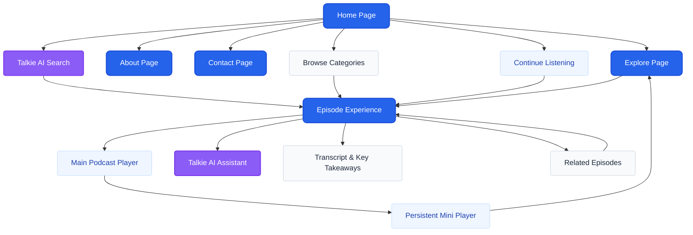

# Talkiepedia Redesign

Welcome to the Talkiepedia Redesign project! Talkiepedia is a career-focused podcast and knowledge-sharing platform built to connect learners with industry leaders. 

# 🏗 Product Information Architecture & User Flow

The redesigned Talkiepedia follows a Discovery → Consumption → Continuous Learning architecture that minimizes navigation friction while encouraging uninterrupted knowledge exploration.

## Information Architecture

## Design Philosophy

- **Search-First Discovery:** Talkie AI Search is positioned prominently to capture intent immediately.
- **AI-Assisted Learning:** The integrated Talkie AI feature acts as a companion for deep episode exploration.
- **Persistent Listening:** Global playback architecture prevents audio disruption during site navigation.
- **Continuous Exploration:** Suggestion loops through "Related Episodes" build frictionless retention paths.
- **Reduced Navigation Friction:** A flattened hierarchy ensures users find the content they need without deep menu diving.

## Primary User Journey

1. **Discovery:** The user arrives at the Homepage and inputs a career-focused query into the Talkie AI Search.
2. **Consumption:** The user selects a targeted episode, landing on the Episode Experience page to listen while viewing time-synced transcripts and key takeaways.
3. **Continuous Learning:** The user starts audio playback, triggering the persistent Mini Player. They seamlessly navigate to the Explore page to queue another episode without interrupting the audio.

## Key UX Improvements

- **AI-Assisted Search:** Direct intent capture without manual browsing.
- **Continue Listening:** A clear, habit-forming loop for returning users.
- **Persistent Mini Player:** Uninterrupted global audio playback.
- **Improved Content Discovery:** Dynamic category filtering directly on the homepage.
- **Better Navigation:** Flatter hierarchy with direct pathways.
- **Learning-Focused Episode Experience:** Integrated transcripts, takeaways, and Talkie AI context.
